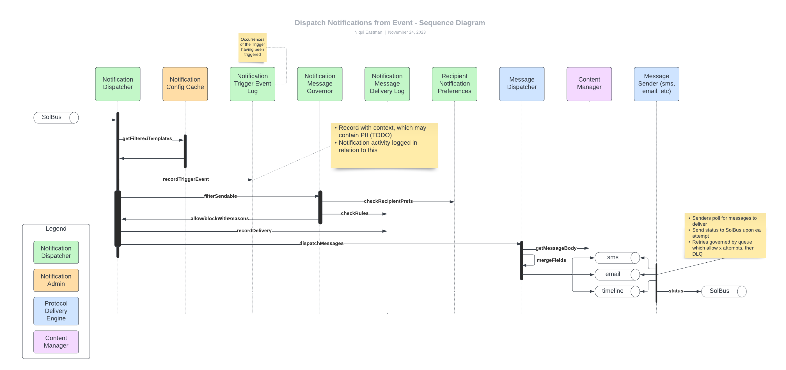

# Notification Dispatcher

TODO:

Event handler which initiates the delivery of notifications.

Written as a listener on the main bus, the Notification Dispatcher:

* subscribes to messages with known noun/verb combos.
* filters messages to ones for which Message Configs exist
* records receipt of a message which matched existing Configs.
* requests clearance from the Notification Message Governor to send messages.
* records initiating send of message with Notification Delivery Log, preventing subsequent attempts (rapid receipt of a same message.
* sends the Message Template details along with the message payload to the Message Dispatcher to merge, package, and deliver the notification message to the ultimate recipient.

The following concerns are represented by this module.

## Notification Dispatcher

Event handler, subscribing to messages on the SolBus for which there are Notification Triggers. 
Dispatching a notification, at this level, is to determine what messages to send in response by:

* Assess each Message Template associated with each Event Trigger for the message subject and verb
* Assess each Message Template criteria met by the message
* Send message metadata and Message Template ID to the Message Governor for rights to deliver
* Send each permitted messages to the respective sender via SQS

## Notification Config Cache

Yet undecided, but an alternative to hitting the DB.

## Notification Trigger Event Log

When an event triggers a notification, it must be logged as priority.
This is to minimize chances of rapid-fire triggering notifications. 

